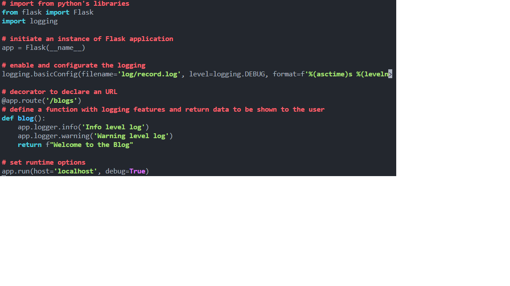

# tp-coaching-webforce3

Instruction pour la session de coaching

exercice 1
Réalisation d'un baclog du projet
une fois le screen fait et ajouté au dossier on peut faire les commandes suivantes

```
git add . (pour ajouter tous les fichiers modifier ou nouveau depuis ledernier commit)
git commit -m "nom_de_mon_commit" (pour commit tous les fichiers ensemble)
git push (pour push le commit dans le repo github)
```

exercice 2
Mettre à jour les packages de la VM

- sudo apt update
- sudo apt upgrade

vérifier la version de python3 déjà instalée

- python3 --version

créer un alias python pour appeler python3

- sudo vi /home/ubuntu/.bash_aliases
  - #!/bin/bash
  - alias python='python3'

tester l'alias

- python -v

installer flask pour python

- sudo apt install pip
- sudo pip install flask
- flask --version

exercice 3

rechercher le disque dur connecté

- sudo fdisk -l | grep "1 GiB"
  formater le disque
- sudo mkfs -t ext4 /dev/vdc
  créer un point de montage
- sudo mkdir /home/tp-coaching-webforce3/log
  monter le disque sur le point de montage
- sudo mount /dev/vdc /home/tp-coaching-webforce3/log

exercice 4

configuration déjà réalisée

exercice 5

création du fichier blogs + affectation des droits
- touch blogs.py | sudo chmod +777 blogs.py
ouverture puis on colle le texte à l'intérieur
- nano blogs.py

ajouter une variable d'environnement pour le bon fonctionnement
- cd /home/tp-coaching-webforce3
- export FLASK_APP=blogs.py
configurer de manière permanente
- nano / home/ubuntu/.bashrc
    - export FLASK_APP=blogs.py
mettre en marche la modification
- source /home/ubuntu/.bashrc
ajuster les permissions du répertoire log pour que Flask puisse s'y exécuter
- sudo chmod 777 log
Lancer l'application Flask
- flask run --host=0.0.0.0 -p 30101
Depuis un navigateur, ouvrir l'url 
- http://<ip_de_votre_vm>:30101/blogs.
Verifier que le fichier record.log existe
- cd /home/tp-coaching-webforce3/log
- ls


exercice 6
